# KrishiSahayak Architecture

This document outlines the technical architecture of the KrishiSahayak AI-powered plant disease detection system.

## 1. System Overview

KrishiSahayak is built on a modern AI/ML stack, combining deep learning, computer vision, and web technologies to provide an accessible plant disease detection solution. The system is designed with scalability, performance, and explainability in mind.

### 1.1 Core Components

- **Deep Learning Model**: Hybrid RGB+MS architecture with GAN-based NIR generation
  - Primary model for RGB processing
  - Optional fusion with multispectral data
  - Confidence-based fallback mechanism
  - GAN for synthetic NIR generation when needed

- **Data Pipeline**: Unified data loading and preprocessing
  - Handles both RGB and multispectral inputs
  - Robust error handling for corrupt images
  - Configurable data augmentation

- **Inference Engine**: Optimized prediction pipeline
  - Batch processing support
  - Top-k predictions with confidence scores
  - Hardware-accelerated execution

- **RESTful API**: FastAPI-based backend
  - Asynchronous request handling
  - Input validation and preprocessing
  - Standardized response format

### 1.2 System Architecture

```mermaid
graph TD
    subgraph User [" 👤 User Layer "]
        A[🌾 Farmer] 
        B[📱 Web/Mobile App]
    end
    
    subgraph Backend [" ⚙️ Backend Services "]
        C[🚪 API Gateway]
        D[🔐 Auth Service]
        E[🧠 Prediction Service]
        F[🖥️ Model Server]
        
        subgraph Models [" 🤖 AI Models "]
            G[🔀 Hybrid Model]
            H[🌈 RGB Model]
            I[🔬 NIR Generator]
            J[🔗 Fusion Layer]
        end
    end
    
    subgraph Data [" 📊 Data Storage "]
        K[📚 Training Data]
        L[✅ Validation Data]
        M[🧪 Test Data]
    end
    
    A -->|Uploads Image| B
    B -->|HTTP Request| C
    C -->|Authenticate| D
    C -->|Process| E
    E -->|Inference| F
    F -->|Execute| G
    G -->|RGB Path| H
    G -->|Generate| I
    G -->|Combine| J
    
    F -.->|Train| K
    F -.->|Validate| L
    F -.->|Test| M
    
    classDef userStyle fill:#e1f5fe,stroke:#0277bd,stroke-width:3px,color:#01579b
    classDef backendStyle fill:#f3e5f5,stroke:#7b1fa2,stroke-width:3px,color:#4a148c
    classDef modelStyle fill:#fff3e0,stroke:#ef6c00,stroke-width:3px,color:#bf360c
    classDef dataStyle fill:#e8f5e8,stroke:#2e7d32,stroke-width:3px,color:#1b5e20
    
    class A,B userStyle
    class C,D,E,F backendStyle
    class G,H,I,J modelStyle
    class K,L,M dataStyle
```



### 1.3 Data Flow


### 1.4 Hybrid Model Architecture

```mermaid
graph TB
    subgraph Input [" 📥 Input Layer "]
        A[🌈 RGB Image<br/>224×224×3]
        C[🔬 NIR Image<br/>224×224×1<br/><i>Optional</i>]
    end
    
    subgraph Processing [" 🔄 Processing Pipeline "]
        B[⚙️ Preprocessing<br/>Normalization & Augmentation]
        F[🤖 NIR Generator<br/>GAN-based Synthesis]
    end
    
    subgraph Model [" 🧠 Neural Network "]
        D[🎯 Feature Extractor<br/>MobileNetV3-Large]
        E[🌈 RGB Features<br/>1280-dim vector]
        G[🔬 Generated NIR<br/>224×224×1]
        H[🔬 NIR Features<br/>1280-dim vector]
        I[🔗 Fusion Layer<br/>Attention Mechanism]
        J[📊 Classification Head<br/>38 Disease Classes]
    end
    
    subgraph Output [" 📤 Output Layer "]
        K[📈 Class Probabilities<br/>Confidence Scores]
        L[🎯 Top-K Predictions<br/>Disease Names]
        M[🗺️ Attention Maps<br/>Visual Explanations]
    end
    
    A --> B
    C -.->|If Available| B
    A -.->|If NIR Missing| F
    B --> D
    D --> E
    F --> G
    G --> H
    E --> I
    H -.->|When Available| I
    I --> J
    J --> K
    K --> L
    K --> M
    
    classDef inputStyle fill:#e3f2fd,stroke:#1976d2,stroke-width:3px,color:#0d47a1
    classDef processStyle fill:#f1f8e9,stroke:#689f38,stroke-width:3px,color:#33691e
    classDef modelStyle fill:#fce4ec,stroke:#c2185b,stroke-width:3px,color:#880e4f
    classDef outputStyle fill:#fff8e1,stroke:#ffa000,stroke-width:3px,color:#e65100
    
    class A,C inputStyle
    class B,F processStyle
    class D,E,G,H,I,J modelStyle
    class K,L,M outputStyle
```



### 1.5 Training Pipeline

```mermaid
flowchart TD
    subgraph DataPrep [" 📊 Data Preparation "]
        A[📁 Data Loading<br/>RGB + NIR Images]
        B[🔄 Data Augmentation<br/>Rotation, Scaling, Color]
    end
    
    subgraph Training [" 🎓 Model Training "]
        C[➡️ Forward Pass<br/>Batch Processing]
        D[📉 Loss Calculation<br/>CrossEntropy + Fusion Loss]
        E[⬅️ Backpropagation<br/>Gradient Computation]
        F[⚡ Optimizer Step<br/>AdamW with Scheduling]
    end
    
    subgraph Validation [" ✅ Model Validation "]
        G[🧪 Validation Loop<br/>Holdout Dataset]
        H[💾 Model Checkpoint<br/>Best Performance]
        I[📊 Metrics Logging<br/>TensorBoard/WandB]
    end
    
    subgraph Monitoring [" 📈 Performance Tracking "]
        J[📋 Training Metrics<br/>Loss, Accuracy, F1]
        K[⏱️ Time Tracking<br/>Epoch Duration]
        L[🎯 Early Stopping<br/>Patience Mechanism]
    end
    
    A --> B
    B --> C
    C --> D
    D --> E
    E --> F
    F --> G
    G -->|Best Model| H
    G --> I
    G --> J
    J --> K
    K --> L
    L -.->|Continue| C
    L -.->|Stop| H
    
    classDef dataStyle fill:#e8f5e8,stroke:#4caf50,stroke-width:3px,color:#1b5e20
    classDef trainStyle fill:#fff3e0,stroke:#ff9800,stroke-width:3px,color:#e65100
    classDef validStyle fill:#e1f5fe,stroke:#03a9f4,stroke-width:3px,color:#01579b
    classDef monitorStyle fill:#f3e5f5,stroke:#9c27b0,stroke-width:3px,color:#4a148c
    
    class A,B dataStyle
    class C,D,E,F trainStyle
    class G,H,I validStyle
    class J,K,L monitorStyle
```



## 2. Model Architecture

### 2.1 Base Model (MobileNetV3-Large)

```mermaid
graph TD
    subgraph Input [" 📥 Input Processing "]
        Input[🖼️ Input Image<br/>224×224×3<br/>RGB Channels]
    end
    
    subgraph Stem [" 🌱 Stem Layer "]
        Conv[🔄 Initial Conv<br/>112×112×16<br/>Stride=2]
    end
    
    subgraph MobileNetV3 [" 🧠 MobileNetV3 Large Backbone "]
        B1[📦 Bottleneck 1<br/>112×112×16<br/>SE Block]
        B2[📦 Bottleneck 2<br/>56×56×24<br/>Depthwise Conv]
        B3[📦 Bottleneck 3<br/>28×28×40<br/>SE + Hard-Swish]
        B4[📦 Bottleneck 4<br/>14×14×80<br/>Expansion=6]
        B5[📦 Bottleneck 5<br/>14×14×112<br/>SE + ReLU]
        B6[📦 Bottleneck 6<br/>14×14×160<br/>Expansion=6]
        B7[📦 Bottleneck 7<br/>7×7×160<br/>Final Features]
        FinalConv[🎯 Final Conv<br/>7×7×960<br/>1×1 Conv]
    end
    
    subgraph Head [" 🎯 Classification Head "]
        GAP[🌐 Global Avg Pool<br/>960→960<br/>Spatial Reduction]
        Dense1[🔗 Dense Layer<br/>960→1280<br/>Hard-Swish]
        Dropout[🎲 Dropout<br/>Rate=0.2<br/>Regularization]
        Dense2[🔗 Dense Layer<br/>1280→512<br/>Hard-Swish]
        Dropout2[🎲 Dropout<br/>Rate=0.1<br/>Final Reg]
        Output[📊 Output Layer<br/>512→38<br/>Disease Classes]
        Softmax[📈 Softmax<br/>Probability Distribution]
    end
    
    Input --> Conv
    Conv --> B1
    B1 --> B2
    B2 --> B3
    B3 --> B4
    B4 --> B5
    B5 --> B6
    B6 --> B7
    B7 --> FinalConv
    
    FinalConv --> GAP
    GAP --> Dense1
    Dense1 --> Dropout
    Dropout --> Dense2
    Dense2 --> Dropout2
    Dropout2 --> Output
    Output --> Softmax
    
    classDef inputStyle fill:#e3f2fd,stroke:#1976d2,stroke-width:3px,color:#0d47a1
    classDef stemStyle fill:#f1f8e9,stroke:#689f38,stroke-width:3px,color:#33691e
    classDef backboneStyle fill:#fce4ec,stroke:#c2185b,stroke-width:3px,color:#880e4f
    classDef headStyle fill:#fff8e1,stroke:#ffa000,stroke-width:3px,color:#e65100
    
    class Input inputStyle
    class Conv stemStyle
    class B1,B2,B3,B4,B5,B6,B7,FinalConv backboneStyle
    class GAP,Dense1,Dropout,Dense2,Dropout2,Output,Softmax headStyle
```

### 2.2 Model Specifications

| Component               | Specification                          |
|-------------------------|---------------------------------------|
| **🤖 Base Model**      | MobileNetV3 Large                     |
| **⚡ Framework**       | PyTorch Lightning                     |
| **📐 Input Size**      | 224×224 RGB images                    |
| **🎯 Output Classes**  | 38 plant diseases                     |
| **🧊 Backbone**        | Frozen pre-trained on ImageNet       |
| **🎯 Classifier Head** | Custom (1280 → Dropout → 38)         |
| **⚡ Activation**      | Hard-Swish (backbone), ReLU (head)   |
| **🔧 Optimizer**       | AdamW                                 |
| **📈 Learning Rate**   | 1e-3 (initial)                       |
| **📦 Batch Size**      | 32                                    |

### 2.3 Performance Metrics

```mermaid
graph LR
    subgraph CPU [" 💻 CPU Performance "]
        A[⏱️ Inference Time<br/>~50ms]
        B[💾 Memory Usage<br/>~100MB]
        C[📊 Accuracy<br/>96.2%]
    end
    
    subgraph GPU [" 🚀 GPU Performance "]
        D[⚡ Inference Time<br/>~10ms]
        E[💾 Memory Usage<br/>~1.5GB]
        F[📊 Accuracy<br/>96.2%]
    end
    
    subgraph Model [" 🤖 Model Stats "]
        G[📦 Model Size<br/>15MB (.pth)]
        H[📁 ONNX Size<br/>14MB]
        I[🎯 F1-Score<br/>95.8%]
    end
    
    classDef cpuStyle fill:#e3f2fd,stroke:#1976d2,stroke-width:3px,color:#0d47a1
    classDef gpuStyle fill:#e8f5e8,stroke:#4caf50,stroke-width:3px,color:#1b5e20
    classDef modelStyle fill:#fff3e0,stroke:#ff9800,stroke-width:3px,color:#e65100
    
    class A,B,C cpuStyle
    class D,E,F gpuStyle
    class G,H,I modelStyle
```

### 2.4 Key Features

```mermaid
mindmap
  root((🤖 MobileNetV3<br/>Features))
    (🏗️ Architecture)
      [Depthwise Separable]
      [Squeeze-Excitation]
      [Hard-Swish Activation]
      [EfficientNet Scaling]
    (🎓 Training)
      [Mixed Precision]
      [Learning Rate Scheduling]
      [Weight Decay]
      [Transfer Learning]
    (🚀 Deployment)
      [ONNX Export]
      [Edge Optimization]
      [Minimal Dependencies]
      [Custom Disease Head]
    (🔍 Explainability)
      [Grad-CAM Integration]
      [Confidence Scoring]
      [Visual Heatmaps]
      [Attention Maps]
```



### 2.5 Custom Head Architecture

```mermaid
graph TD
    subgraph Features [" 🎯 Feature Processing "]
        A[📊 Input Features<br/>960-dim vector<br/>From Backbone]
        B[🔗 Dense 1280<br/>Fully Connected<br/>+ Batch Norm]
        C[⚡ Hard-Swish<br/>Activation Function<br/>Efficient Non-linearity]
        D[🎲 Dropout 0.2<br/>Regularization<br/>Prevent Overfitting]
    end
    
    subgraph Classification [" 🎯 Classification Layers "]
        E[🔗 Dense 512<br/>Intermediate Layer<br/>Feature Refinement]
        F[⚡ Hard-Swish<br/>Activation Function<br/>Non-linear Transform]
        G[🎲 Dropout 0.1<br/>Light Regularization<br/>Final Layer Prep]
        H[📊 Dense 38<br/>Output Layer<br/>Disease Classes]
        I[📈 Softmax<br/>Probability Distribution<br/>Class Confidence]
    end
    
    A --> B
    B --> C
    C --> D
    D --> E
    E --> F
    F --> G
    G --> H
    H --> I
    
    classDef featureStyle fill:#e8f5e8,stroke:#4caf50,stroke-width:3px,color:#1b5e20
    classDef classStyle fill:#e1f5fe,stroke:#03a9f4,stroke-width:3px,color:#01579b
    
    class A,B,C,D featureStyle
    class E,F,G,H,I classStyle
```



## 3. Deployment Architecture

### 3.1 System Components

```mermaid
graph TD
    subgraph Client [" 📱 Client Layer "]
        A[🌾 Farmer's Mobile Device]
        B[🖥️ Web Browser]
        C[📱 Progressive Web App]
    end
    
    subgraph Edge [" 🌐 Edge Layer "]
        D[🌍 CDN <br/>Cloudflare]
        E[🔒 WAF <br/>Web Application Firewall]
        F[⚡ Edge Caching]
    end
    
    subgraph Cloud [" ☁️ Cloud Layer "]
        G[🚀 API Gateway <br/>FastAPI]
        H[🧠 Model Serving <br/>TorchServe]
        I[🗃️ Database <br/>MongoDB Atlas]
        J[📊 Analytics <br/>Elasticsearch]
        K[📦 Object Storage <br/>S3 Compatible]
    end
    
    subgraph MLOps [" 🤖 MLOps "]
        L[🔄 CI/CD Pipeline]
        M[📈 Model Monitoring]
        N[🔍 Data Drift Detection]
        O[🔄 A/B Testing]
    end
    
    %% Connections
    A -->|HTTPS| D
    B -->|HTTPS| D
    C -->|HTTPS| D
    
    D -->|Cached Response| A
    D -->|Cached Response| B
    D -->|Cached Response| C
    
    D -->|API Request| G
    G -->|Authenticate| I
    G -->|Serve Model| H
    G -->|Log Request| J
    G -->|Store Assets| K
    
    H -->|Load Model| K
    H -->|Update Model| L
    
    L -->|Deploy| H
    M -->|Monitor| H
    N -->|Detect Drift| H
    O -->|Test Models| H
    
    %% Styling
    classDef clientStyle fill:#e1f5fe,stroke:#0277bd,stroke-width:3px,color:#01579b
    classDef edgeStyle fill:#f1f8e9,stroke:#689f38,stroke-width:3px,color:#33691e
    classDef cloudStyle fill:#f3e5f5,stroke:#9c27b0,stroke-width:3px,color:#4a148c
    classDef mlopsStyle fill:#fff3e0,stroke:#ff9800,stroke-width:3px,color:#e65100
    
    class A,B,C clientStyle
    class D,E,F edgeStyle
    class G,H,I,J,K cloudStyle
    class L,M,N,O mlopsStyle
```



### 3.2 Deployment Specifications

| Component            | Technology Stack                     |
|----------------------|--------------------------------------|
| **🌐 Web Server**    | Nginx + Gunicorn + Uvicorn           |
| **🚀 API Framework** | FastAPI (Python 3.9+)                |
| **🧠 ML Framework**  | PyTorch 2.0+ with TorchServe         |
| **🗄️ Database**     | MongoDB Atlas (Serverless)           |
| **📊 Analytics**     | Elasticsearch + Kibana               |
| **📦 Storage**       | S3 Compatible (MinIO)                |
| **🔒 Security**      | JWT Auth, Rate Limiting, CORS        |
| **📱 Frontend**      | React Progressive Web App            |


### 3.3 Scaling Configuration

```mermaid
gantt
    title 🚀 Auto-scaling Configuration
    dateFormat  HH:mm
    axisFormat %H:%M
    
    section Horizontal Scaling
    Pod Replicas       :active, pod1, 00:00, 10m
    Pod Replicas       :         pod2, after pod1, 5m
    Pod Replicas       :         pod3, after pod2, 3m
    
    section Vertical Scaling
    CPU Allocation     :crit, cpu1, 00:00, 2m
    Memory Allocation  :crit, mem1, after cpu1, 2m
    GPU Acceleration   :crit, gpu1, after mem1, 2m
    
    section Load Balancer
    Traffic Routing    :active, lb1, 00:00, 10m
    Health Checks      :         hc1, after lb1, 2m
    SSL Termination    :         ssl1, after hc1, 2m
    
    section Monitoring
    Metrics Collection :         metrics1, 00:00, 15m
    Alerts Setup       :         alerts1, after metrics1, 5m
    Log Aggregation    :         logs1, after alerts1, 5m
    
    classDef pod fill:#e1f5fe,stroke:#0277bd,stroke-width:3px,color:#01579b
    classDef resource fill:#f1f8e9,stroke:#689f38,stroke-width:3px,color:#33691e
    classDef network fill:#f3e5f5,stroke:#9c27b0,stroke-width:3px,color:#4a148c
    classDef monitor fill:#fff3e0,stroke:#ff9800,stroke-width:3px,color:#e65100
    
    class pod1,pod2,pod3 pod
    class cpu1,mem1,gpu1 resource
    class lb1,hc1,ssl1 network
    class metrics1,alerts1,logs1 monitor
```

### 3.4 Security Measures

```mermaid
stateDiagram-v2
    [*] --> Request
    
    state Authentication {
        [*] --> ValidateJWT
        ValidateJWT --> CheckRateLimit
        CheckRateLimit --> VerifyOrigin
    }
    
    state Authorization {
        [*] --> CheckPermissions
        CheckPermissions --> ValidateInput
        ValidateInput --> SanitizeData
    }
    
    state Processing {
        [*] --> ProcessRequest
        ProcessRequest --> GenerateResponse
        GenerateResponse --> EncryptData
    }
    
    state Logging {
        [*] --> AuditLog
        AuditLog --> Metrics
        Metrics --> AnomalyDetection
    }
    
    Request --> Authentication
    Authentication --> Authorization
    Authorization --> Processing
    Processing --> Logging
    Logging --> [*]
    
    note right of Authentication: 🔑 JWT Validation & Rate Limiting
    note right of Authorization: 🔒 Role-Based Access Control
    note right of Processing: 🛡️ Input Validation & Sanitization
    note right of Logging: 📊 Comprehensive Audit Trail
    
    classDef secure fill:#ffebee,stroke:#c62828,stroke-width:3px,color:#b71c1c
    classDef process fill:#e8f5e9,stroke:#2e7d32,stroke-width:3px,color:#1b5e20
    classDef monitor fill:#fff3e0,stroke:#ff6f00,stroke-width:3px,color#e65100
    
    class Authentication,Authorization secure
    class Processing process
    class Logging monitor
```



## 4. API Reference

### 4.1 Authentication

```mermaid
sequenceDiagram
    participant C as Client
    participant A as Auth Service
    participant D as Database
    
    C->>A: POST /auth/register
    A->>D: Check existing user
    D-->>A: User not found
    A->>D: Create new user
    D-->>A: User created
    A-->>C: 201 Created + JWT
    
    C->>A: POST /auth/login
    A->>D: Verify credentials
    D-->>A: Credentials valid
    A-->>C: 200 OK + JWT
    
    Note over C,A: JWT is valid for 24h
    Note over C,A: Refresh token available
    
    classDef success fill:#e8f5e9,stroke:#2e7d32,stroke-width:3px,color:#1b5e20
    class 201,200 success
```

### 4.2 Core Endpoints

| Endpoint | Method | Description | Auth Required |
|----------|--------|-------------|----------------|
| `/predict` | POST | Process plant image | ✅ |
| `/batch-predict` | POST | Process multiple images | ✅ |
| `/history` | GET | Get prediction history | ✅ |
| `/models` | GET | List available models | ✅ |
| `/health` | GET | Service health check | ❌ |

## 5. Performance Optimization

### 5.1 Caching Strategy


### 5.2 Performance Benchmarks

| Metric | Value | Notes |
|--------|-------|-------|
| API Response Time | <100ms | P95 latency |
| Model Inference | 50ms | On CPU |
| Throughput | 1000 RPM | Per instance |
| Cache Hit Ratio | 95% | Edge + Redis |
| Uptime | 99.99% | Monthly |

## 6. Monitoring & Maintenance

### 6.1 Key Metrics

- **System Health**: CPU, Memory, Disk Usage
- **API Performance**: Latency, Error Rates, Throughput
- **Model Metrics**: Prediction Accuracy, Drift Detection
- **Business KPIs**: Active Users, Predictions/Day

### 6.2 Alerting Rules

```mermaid
graph LR
    subgraph Rules [" 🚨 Alert Rules "]
        A[High Error Rate > 5%]
        B[P99 Latency > 1s]
        C[CPU Usage > 80%]
        D[Model Drift Detected]
    end
    
    subgraph Actions [" 🔔 Notification Channels "]
        E[Email Alerts]
        F[Slack Notifications]
        G[PagerDuty]
    end
    
    A --> E
    B --> F
    C --> G
    D --> E & F & G
    
    classDef alert fill:#ffebee,stroke:#c62828,stroke-width:3px,color:#b71c1c
    classDef notify fill:#e8f5e9,stroke:#2e7d32,stroke-width:3px,color:#1b5e20
    
    class A,B,C,D alert
    class E,F,G notify
```



## 7. Future Enhancements

### 7.1 Planned Features

- **Multi-language Support**: Expand to more regional languages
- **Offline Mode**: Core functionality without internet
- **Augmented Reality**: Visual disease overlay
- **Soil Analysis**: Integration with soil sensors
- **Marketplace**: Connect farmers with suppliers

### 7.2 Research Directions

- **Federated Learning**: Privacy-preserving model updates
- **Few-shot Learning**: Better handling of rare diseases
- **Multimodal Inputs**: Combine image, text, and sensor data
- **Edge AI**: On-device processing for low-connectivity areas

## 8. Conclusion

KrishiSahayak's architecture is designed for scalability, reliability, and performance. The system leverages modern AI/ML techniques while maintaining a focus on usability for farmers in rural areas. The modular design allows for easy updates and maintenance, ensuring the system can evolve with changing requirements.

### 8.1 Key Strengths

- **Scalable**: Handles thousands of concurrent users
- **Accurate**: State-of-the-art deep learning models
- **Accessible**: Works on low-end devices
- **Maintainable**: Clear separation of concerns
- **Extensible**: Easy to add new features

### 8.2 Getting Started

For development setup and deployment instructions, please refer to the [README.md](README.md) in the project root.

---

*Last Updated: October 2023*
*Version: 2.0.0*
