# KrishiSahayak Architecture

**Version:** 2.0  
**Last Updated:** June 2025

## 1. System Overview

KrishiSahayak is an AI-powered plant disease classification system designed to help farmers identify crop diseases from leaf images. The system supports both RGB and multispectral (MS) image inputs, with the ability to generate synthetic NIR (Near-Infrared) data when MS data is not available.

### Core Components

1. **UnifiedModel**: The primary model architecture for plant disease classification.
   - Defined in: `src/krishi_sahayak/models/core/unified_model.py`
   - Supports multiple input streams (RGB, MS)
   - Configurable fusion strategies
   - Extensible architecture for different backbones

2. **HybridModel**: A wrapper that combines RGB and MS models with fallback logic.
   - Defined in: `src/krishi_sahayak/models/core/hybrid_model.py`
   - Handles NIR generation when MS data is not available
   - Implements confidence-based fallback between models
   - Validates fusion results for robustness

3. **Inference Pipeline**: Handles model loading and prediction.
   - Components in: `src/krishi_sahayak/inference/`
   - Model loading and validation
   - Batch prediction support
   - Input preprocessing and output postprocessing

4. **REST API**: FastAPI-based web service.
   - Defined in: `src/krishi_sahayak/api/`
   - Health check endpoint
   - Image prediction endpoint
   - Automatic model loading and caching

## 2. Model Architecture

### 2.1 UnifiedModel

The core model architecture that supports multiple input streams and fusion strategies.


### 2.2 HybridModel

A wrapper that combines RGB and MS models with fallback logic.


### 2.3 Model Configuration

Example model configuration (from `src/krishi_sahayak/config/config.yaml`):

```yaml
model:
  backbone_name: "efficientnet_b0"
  streams:
    rgb:
      channels: 3
      adapter_out: null
      pretrained: true
    nir:
      channels: 1
      adapter_out: 3  # Adapts NIR to 3 channels for standard backbones
      pretrained: false
  fusion:
    method: "cross_attention"
    num_heads: 8
    dropout_rate: 0.1
  classifier_hidden_dim: 512
  classifier_dropout: 0.2
```

## 3. API Reference

### 3.1 Health Check

**Endpoint:** `GET /health`

**Response:**
```json
{
  "status": "healthy",
  "version": "1.0.0",
  "device": "cuda"
}
```

### 3.2 Prediction

**Endpoint:** `POST /predict`

**Request:**
- Content-Type: `multipart/form-data`
- Body: Image file with key `file`

**Response:**
```json
{
  "filename": "example.jpg",
  "predictions": [
    {
      "class_name": "Tomato___Late_blight",
      "confidence": 0.987
    },
    {
      "class_name": "Tomato___healthy",
      "confidence": 0.012
    },
    {
      "class_name": "Tomato___Early_blight",
      "confidence": 0.001
    }
  ],
  "model_checkpoint": "path/to/model.ckpt"
}
```

## 4. Project Structure

```
krishi_sahayak/
├── models/                  # Model architectures and components
│   ├── __init__.py
│   ├── core/               # Core model implementations
│   │   ├── __init__.py
│   │   ├── base_model.py   # Base model class
│   │   ├── unified_model.py
│   │   └── hybrid_model.py
│   └── backbones/          # Model backbones and feature extractors
│       ├── __init__.py
│       ├── efficientnet.py
│       └── resnet.py
│
├── inference/            # Model inference components
│   ├── __init__.py
│   ├── predictor.py        # Main prediction interface
│   ├── preprocess.py       # Input preprocessing
│   └── postprocess.py      # Output postprocessing
│
├── config/               # Configuration management
│   ├── __init__.py
│   ├── config.py          # Configuration loading and validation
│   └── schemas.py         # Pydantic models for config validation
│
├── api/                  # Web API components
│   ├── __init__.py
│   ├── app.py             # FastAPI application
│   ├── routes.py          # API endpoint definitions
│   └── schemas.py         # Request/response models
│
├── launchers/           # Script launchers
│   └── training_launcher.py  # Training script entry point
│
├── pipelines/           # Data and training pipelines
│   ├── __init__.py
│   ├── job_manager.py     # Pipeline job management
│   └── runners.py         # Pipeline execution
│
├── utils/               # Utility functions
│   ├── __init__.py
│   ├── logger.py          # Logging configuration
│   ├── hardware.py        # Hardware utilities
│   ├── visualization.py   # Visualization helpers
│   └── seed.py            # Random seed management
│
└── data/                # Data handling (optional, may be external)
    └── __init__.py
```

## 5. Deployment

The system is designed to be deployed as a containerized application using Docker. The API service can be scaled horizontally behind a load balancer.

### 5.1 Environment Variables

| Variable | Description | Default |
|----------|-------------|---------|
| `MODEL_PATH` | Path to the model checkpoint | `models/unified_model.ckpt` |
| `DEVICE` | Device to run inference on | `auto` (auto-detects CUDA) |
| `LOG_LEVEL` | Logging level | `INFO` |

### 5.2 Docker

```dockerfile
FROM python:3.9-slim

WORKDIR /app

# Install system dependencies
RUN apt-get update && apt-get install -y \
    libgl1-mesa-glx \
    libglib2.0-0 \
    && rm -rf /var/lib/apt/lists/*

# Install Python dependencies
COPY requirements.txt .
RUN pip install --no-cache-dir -r requirements.txt

# Copy application code
COPY . .

# Expose the API port
EXPOSE 8000

# Run the application
CMD ["uvicorn", "krishi_sahayak.api.main:app", "--host", "0.0.0.0", "--port", "8000"]
```

## 6. Development

### 6.1 Setup

1. Create a virtual environment:
   ```bash
   python -m venv venv
   source venv/bin/activate  # On Windows: venv\Scripts\activate
   ```

2. Install development dependencies:
   ```bash
   pip install -r requirements-dev.txt
   ```

3. Install the package in development mode:
   ```bash
   pip install -e .
   ```

### 6.2 Running Tests

```bash
pytest tests/
```

### 6.3 Code Style

This project uses `black` for code formatting and `isort` for import sorting. To format the code:

```bash
black .
isort .
```

## 7. License

[Specify License Here]

## 8. Contact

[Your Contact Information]

This document outlines the technical architecture of the KrishiSahayak AI-powered plant disease detection system.

## 1. System Overview
KrishiSahayak is built on a modern AI/ML stack, combining deep learning, computer vision, and web technologies to provide an accessible plant disease detection solution. The system is designed with scalability, performance, and explainability in mind.

### 1.1 Core Components
- **Deep Learning Model**: Hybrid RGB+MS architecture with GAN-based NIR generation
  - Primary model for RGB processing, based on a timm backbone.
  - Optional fusion with multispectral data using configurable methods.
  - Confidence-based fallback mechanism for robust inference.
  - GAN for synthetic NIR generation when real multispectral data is unavailable.

- **Data Pipeline**: Unified data loading and preprocessing
  - Handles both RGB and multispectral inputs.
  - Robust error handling for corrupt images.
  - Configurable data augmentation via albumentations.

- **Inference Engine**: Optimized prediction pipeline
  - Batch processing support.
  - Top-k predictions with confidence scores.
  - Hardware-accelerated execution (cuda, mps, cpu).

- **RESTful API**: [Concept] A proposed FastAPI-based backend.
  - Asynchronous request handling.
  - Input validation and preprocessing.
  - Standardized response format.

- **Deep Learning Model**: Hybrid RGB+MS architecture with GAN-based NIR generation
  - Primary model for RGB processing
  - Optional fusion with multispectral data
  - Confidence-based fallback mechanism
  - GAN for synthetic NIR generation when needed

- **Data Pipeline**: Unified data loading and preprocessing
  - Handles both RGB and multispectral inputs
  - Robust error handling for corrupt images
  - Configurable data augmentation

- **Inference Engine**: Optimized prediction pipeline
  - Batch processing support
  - Top-k predictions with confidence scores
  - Hardware-accelerated execution

- **RESTful API**: FastAPI-based backend
  - Asynchronous request handling
  - Input validation and preprocessing
  - Standardized response format

### 1.2 System Architecture

```mermaid
graph TD
    subgraph User [" 👤 User Layer "]
        A[🌾 Farmer] 
        B[📱 Web/Mobile App]
    end
    
    subgraph Backend [" ⚙️ Backend Services "]
        C[🚪 API Gateway]
        D[🔐 Auth Service]
        E[🧠 Prediction Service]
        F[🖥️ Model Server]
        
        subgraph Models [" 🤖 AI Models "]
            G[🔀 Hybrid Model]
            H[🌈 RGB Model]
            I[🔬 NIR Generator]
            J[🔗 Fusion Layer]
        end
    end
    
    subgraph Data [" 📊 Data Storage "]
        K[📚 Training Data]
        L[✅ Validation Data]
        M[🧪 Test Data]
    end
    
    A -->|Uploads Image| B
    B -->|HTTP Request| C
    C -->|Authenticate| D
    C -->|Process| E
    E -->|Inference| F
    F -->|Execute| G
    G -->|RGB Path| H
    G -->|Generate| I
    G -->|Combine| J
    
    F -.->|Train| K
    F -.->|Validate| L
    F -.->|Test| M
    
    classDef userStyle fill:#e1f5fe,stroke:#0277bd,stroke-width:2px,color:#01579b
    classDef backendStyle fill:#f3e5f5,stroke:#7b1fa2,stroke-width:2px,color:#4a148c
    classDef modelStyle fill:#fff3e0,stroke:#ef6c00,stroke-width:2px,color:#bf360c
    classDef dataStyle fill:#e8f5e8,stroke:#2e7d32,stroke-width:2px,color:#1b5e20
    
    class A,B userStyle
    class C,D,E,F backendStyle
    class G,H,I,J modelStyle
    class K,L,M dataStyle
```


### 1.3 Data Flow

```mermaid
sequenceDiagram
    participant User as 👤 User
    participant App as 📱 Mobile App
    participant Gateway as 🚪 API Gateway
    participant Model as 🤖 Model Service
    participant DB as 💾 Database
    
    Note over User,DB: Plant Disease Detection Flow
    
    User->>+App: Upload plant image 🌿
    Note right of User: Farmer captures leaf photo
    
    App->>+Gateway: POST /predict 📤
    Note right of App: Image with metadata
    
    Gateway->>+Model: Process image request
    Note right of Gateway: Authenticated request
    
    Model->>Model: Preprocess image 🔄
    Note right of Model: Resize, normalize, augment
    
    Model->>Model: Run AI inference 🧠
    Note right of Model: Hybrid model prediction
    
    Model-->>-Gateway: Return predictions 📊
    Note left of Model: Disease class + confidence
    
    Gateway->>+DB: Log prediction 📝
    Note right of Gateway: Store for analytics
    
    DB-->>-Gateway: Acknowledge ✅
    
    Gateway->>-App: Return diagnosis 🩺
    Note left of Gateway: JSON response with results
    
    App->>-User: Display results 📋
    Note left of App: Disease name + treatment
```



### 1.4 Hybrid Model Architecture

```mermaid
graph TB
    subgraph Input [" 📥 Input Layer "]
        A[🌈 RGB Image<br/>224×224×3]
        C[🔬 NIR Image<br/>224×224×1<br/>Optional]
    end
    
    subgraph Processing [" 🔄 Processing Pipeline "]
        B[⚙️ Preprocessing<br/>Normalization & Augmentation]
        F[🤖 NIR Generator<br/>GAN-based Synthesis]
    end
    
    subgraph Model [" 🧠 Neural Network "]
        D[🎯 Feature Extractor<br/>MobileNetV3-Large]
        E[🌈 RGB Features<br/>1280-dim vector]
        G[🔬 Generated NIR<br/>224×224×1]
        H[🔬 NIR Features<br/>1280-dim vector]
        I[🔗 Fusion Layer<br/>Attention Mechanism]
        J[📊 Classification Head<br/>38 Disease Classes]
    end
    
    subgraph Output [" 📤 Output Layer "]
        K[📈 Class Probabilities<br/>Confidence Scores]
        L[🎯 Top-K Predictions<br/>Disease Names]
        M[🗺️ Attention Maps<br/>Visual Explanations]
    end
    
    A --> B
    C -.->|If Available| B
    A -.->|If NIR Missing| F
    B --> D
    D --> E
    F --> G
    G --> H
    E --> I
    H -.->|When Available| I
    I --> J
    J --> K
    K --> L
    K --> M
    
    classDef inputStyle fill:#e3f2fd,stroke:#1976d2,stroke-width:2px,color:#0d47a1
    classDef processStyle fill:#f1f8e9,stroke:#689f38,stroke-width:2px,color:#33691e
    classDef modelStyle fill:#fce4ec,stroke:#c2185b,stroke-width:2px,color:#880e4f
    classDef outputStyle fill:#fff8e1,stroke:#ffa000,stroke-width:2px,color:#e65100
    
    class A,C inputStyle
    class B,F processStyle
    class D,E,G,H,I,J modelStyle
    class K,L,M outputStyle
```



### 1.5 Training Pipeline

```mermaid
flowchart TD
    subgraph DataPrep [" 📊 Data Preparation "]
        A[📁 Data Loading<br/>RGB + NIR Images]
        B[🔄 Data Augmentation<br/>Rotation, Scaling, Color]
    end
    
    subgraph Training [" 🎓 Model Training "]
        C[➡️ Forward Pass<br/>Batch Processing]
        D[📉 Loss Calculation<br/>CrossEntropy + Fusion Loss]
        E[⬅️ Backpropagation<br/>Gradient Computation]
        F[⚡ Optimizer Step<br/>AdamW with Scheduling]
    end
    
    subgraph Validation [" ✅ Model Validation "]
        G[🧪 Validation Loop<br/>Holdout Dataset]
        H[💾 Model Checkpoint<br/>Best Performance]
        I[📊 Metrics Logging<br/>TensorBoard/WandB]
    end
    
    subgraph Monitoring [" 📈 Performance Tracking "]
        J[📋 Training Metrics<br/>Loss, Accuracy, F1]
        K[⏱️ Time Tracking<br/>Epoch Duration]
        L[🎯 Early Stopping<br/>Patience Mechanism]
    end
    
    A --> B
    B --> C
    C --> D
    D --> E
    E --> F
    F --> G
    G -->|Best Model| H
    G --> I
    G --> J
    J --> K
    K --> L
    L -.->|Continue| C
    L -.->|Stop| H
    
    classDef dataStyle fill:#e8f5e8,stroke:#4caf50,stroke-width:3px,color:#1b5e20
    classDef trainStyle fill:#fff3e0,stroke:#ff9800,stroke-width:3px,color:#e65100
    classDef validStyle fill:#e1f5fe,stroke:#03a9f4,stroke-width:3px,color:#01579b
    classDef monitorStyle fill:#f3e5f5,stroke:#9c27b0,stroke-width:3px,color:#4a148c
    
    class A,B dataStyle
    class C,D,E,F trainStyle
    class G,H,I validStyle
    class J,K,L monitorStyle
```



## 2. Model Architecture

### 2.1 Base Model (EfficientNet-B0)

```mermaid
graph TD
    subgraph Input [" 📥 Input Processing "]
        Input[🖼️ Input Image<br/>224×224×3<br/>RGB Channels]
    end
    
    subgraph Stem [" 🌱 Stem Layer "]
        Conv[🔄 Initial Conv<br/>112×112×32<br/>Stride=2]
    end
    
    subgraph EfficientNetB0 [" 🧠 EfficientNet-B0 Backbone "]
        MB1[📦 MBConv, k=3, s=1, E=1]
        MB2[📦 MBConv, k=3, s=2, E=6]
        MB3[📦 MBConv, k=5, s=2, E=6]
        MB4[📦 MBConv, k=3, s=2, E=6]
        MB5[📦 MBConv, k=5, s=1, E=6]
        MB6[📦 MBConv, k=5, s=2, E=6]
        MB7[📦 MBConv, k=3, s=1, E=6]
        B2[📦 Bottleneck 2<br/>56×56×24<br/>Depthwise Conv]
        B3[📦 Bottleneck 3<br/>28×28×40<br/>SE + Hard-Swish]
        B4[📦 Bottleneck 4<br/>14×14×80<br/>Expansion=6]
        B5[📦 Bottleneck 5<br/>14×14×112<br/>SE + ReLU]
        B6[📦 Bottleneck 6<br/>14×14×160<br/>Expansion=6]
        B7[📦 Bottleneck 7<br/>7×7×160<br/>Final Features]
        FinalConv[🎯 Final Conv<br/>7×7×320<br/>1×1 Conv]
    end
    
    subgraph Head [" 🎯 Classification Head "]
        GAP[🌐 Global Avg Pool<br/>1280 Features]
        Dropout[🎲 Dropout<br/>Regularization]
        Output[📊 Output Layer<br/>1280 → N Classes]
        Softmax[📈 Softmax<br/>Probability Distribution]
    end
    
    Input --> Conv
    Conv --> MB1 --> MB2 --> MB3 --> MB4 --> MB5 --> MB6 --> MB7
    MB7 --> FinalConv
    FinalConv --> GAP
    GAP --> Dropout
    Dropout --> Output
    Output --> Softmax
    
    classDef inputStyle fill:#e3f2fd,stroke:#1976d2,stroke-width:2px,color:#0d47a1
    classDef stemStyle fill:#f1f8e9,stroke:#689f38,stroke-width:2px,color:#33691e
    classDef backboneStyle fill:#fce4ec,stroke:#c2185b,stroke-width:2px,color:#880e4f
    classDef headStyle fill:#fff8e1,stroke:#ffa000,stroke-width:2px,color:#e65100
    
    class Input inputStyle
    class Conv stemStyle
    class MB1,MB2,MB3,MB4,MB5,MB6,MB7 backboneStyle
    class FinalConv,GAP,Dropout,Output,Softmax headStyle
```

### 2.2 Model Specifications

| Component | Specification | Source |
|-----------|---------------|--------|
| 🤖 Base Model | EfficientNet-B0 | `config.yaml` |
| ⚡ Framework | PyTorch Lightning | `base.py` |
| 📐 Input Size | 224×224 RGB images | `transforms.py` |
| 🎯 Output Classes | Configurable (e.g., 38) | `unified_model.py` |
| 🧊 Backbone | Pre-trained on ImageNet | `unified_model.py` |
| 🎯 Classifier Head | Custom, configurable | `unified_model.py` |
| ⚡ Activation | SiLU (Swish) | (EfficientNet default) |
| 🔧 Optimizer | AdamW | `config.yaml` |
| 📈 Learning Rate | 1e-3 (initial) | `config.yaml` |
| 📦 Batch Size | 32 | `config.yaml` |

### 2.3 Performance Metrics
*Note: All performance metrics are pending final evaluation runs as per the project roadmap.*

```mermaid
graph LR
    subgraph CPU [" 💻 CPU Performance "]
        A[⏱️ Inference Time<br/>[TODO: Pending Profiling]]
        B[💾 Memory Usage<br/>[TODO: Pending Profiling]]
        C[📊 Accuracy<br/>[TODO: Pending Evaluation]]
    end
    
    subgraph GPU [" 🚀 GPU Performance "]
        D[⚡ Inference Time<br/>[TODO: Pending Profiling]]
        E[💾 Memory Usage<br/>[TODO: Pending Profiling]]
        F[📊 Accuracy<br/>[TODO: Pending Evaluation]]
    end
    
    subgraph Model [" 🤖 Model Stats "]
        G[📦 Model Size<br/>[TODO: Pending Final Checkpoint]]
        H[📁 ONNX Size<br/>[TODO: Pending Export]]
        I[🎯 F1-Score<br/>[TODO: Pending Evaluation]]
    end
    
    classDef cpuStyle fill:#e3f2fd,stroke:#1976d2,stroke-width:2px,color:#0d47a1
    classDef gpuStyle fill:#e8f5e8,stroke:#4caf50,stroke-width:2px,color:#1b5e20
    classDef modelStyle fill:#fff3e0,stroke:#ff9800,stroke-width:2px,color:#e65100
    
    class A,B,C cpuStyle
    class D,E,F gpuStyle
    class G,H,I modelStyle
```

### 2.4 Key Features

```mermaid
mindmap
  root((🤖 MobileNetV3<br/>Features))
    (🏗️ Architecture)
      [Depthwise Separable]
      [Squeeze-Excitation]
      [Hard-Swish Activation]
      [EfficientNet Scaling]
    (🎓 Training)
      [Mixed Precision]
      [Learning Rate Scheduling]
      [Weight Decay]
      [Transfer Learning]
    (🚀 Deployment)
      [ONNX Export]
      [Edge Optimization]
      [Minimal Dependencies]
      [Custom Disease Head]
    (🔍 Explainability)
      [Grad-CAM Integration]
      [Confidence Scoring]
      [Visual Heatmaps]
      [Attention Maps]
```



### 2.5 Custom Head Architecture

```mermaid
graph TD
    subgraph Features [" 🎯 Feature Processing "]
        A[📊 Input Features<br/>960-dim vector<br/>From Backbone]
        B[🔗 Dense 1280<br/>Fully Connected<br/>+ Batch Norm]
        C[⚡ Hard-Swish<br/>Activation Function<br/>Efficient Non-linearity]
        D[🎲 Dropout 0.2<br/>Regularization<br/>Prevent Overfitting]
    end
    
    subgraph Classification [" 🎯 Classification Layers "]
        E[🔗 Dense 512<br/>Intermediate Layer<br/>Feature Refinement]
        F[⚡ Hard-Swish<br/>Activation Function<br/>Non-linear Transform]
        G[🎲 Dropout 0.1<br/>Light Regularization<br/>Final Layer Prep]
        H[📊 Dense 38<br/>Output Layer<br/>Disease Classes]
        I[📈 Softmax<br/>Probability Distribution<br/>Class Confidence]
    end
    
    A --> B
    B --> C
    C --> D
    D --> E
    E --> F
    F --> G
    G --> H
    H --> I
    
    classDef featureStyle fill:#e8f5e8,stroke:#4caf50,stroke-width:3px,color:#1b5e20
    classDef classStyle fill:#e1f5fe,stroke:#03a9f4,stroke-width:3px,color:#01579b
    
    class A,B,C,D featureStyle
    class E,F,G,H,I classStyle
```



## 3. Deployment Architecture (Conceptual)
*The following diagrams outline the conceptual architecture for deploying KrishiSahayak as a scalable, production-grade service. Note: The code for this deployment stack was not provided for review.*

### 3.1 System Components

```mermaid
graph TD
    subgraph Client [" 📱 Client Layer "]
        A[🌾 Farmer's Mobile Device]
        B[🖥️ Web Browser]
        C[📱 Progressive Web App]
    end
    
    subgraph Edge [" 🌐 Edge Layer "]
        D[🌍 CDN]
        E[🔒 WAF]
    end
    
    subgraph Cloud [" ☁️ Cloud Layer "]
        G[🚀 API Gateway <br/>FastAPI]
        H[🧠 Model Serving <br/>TorchServe]
        I[🗃️ Database <br/>MongoDB Atlas]
        J[📊 Analytics]
        K[📦 Object Storage]
    end
    
    subgraph MLOps [" 🤖 MLOps "]
        L[🔄 CI/CD Pipeline]
        M[📈 Model Monitoring]
    end
    
    A & B & C --> D --> E --> G
    G --> H
    G --> I & J & K
    L --> H
    H --> M
    
    classDef clientStyle fill:#e1f5fe,stroke:#0277bd,stroke-width:2px,color:#01579b
    classDef edgeStyle fill:#f1f8e9,stroke:#689f38,stroke-width:2px,color:#33691e
    classDef cloudStyle fill:#f3e5f5,stroke:#9c27b0,stroke-width:2px,color:#4a148c
    classDef mlopsStyle fill:#fff3e0,stroke:#ff9800,stroke-width:2px,color:#e65100
    
    class A,B,C clientStyle
    class D,E edgeStyle
    class G,H,I,J,K cloudStyle
    class L,M mlopsStyle
```


### 3.2 Auto-scaling Configuration


### 3.3 Security State Machine

```mermaid
stateDiagram-v2
    [*] --> Request
    Request --> Authentication
    Authentication --> |Valid Token| Authorization
    Authentication --> |Invalid Token| Reject
    Authorization --> |Has Permission| RateLimit
    Authorization --> |No Permission| Forbidden
    RateLimit --> |Under Limit| Process
    RateLimit --> |Over Limit| Throttle
    Process --> |Success| Log
    Process --> |Error| ErrorHandling
    Log --> [*]
    Throttle --> [*]
    Forbidden --> [*]
    Reject --> [*]
    ErrorHandling --> [*]
    
    state "🔒 Security Layer" as SL {
        Authentication
        Authorization
        RateLimit
    }
    
    state "🛡️ Protection" as P {
        Throttle
        Forbidden
        Reject
        ErrorHandling
    }
```


### 3.4 Caching Strategy


### 3.5 Alert Rules

```mermaid
pie title Alert Rules
    "🚨 High Priority (P0)" : 15
    "⚠️ Medium Priority (P1)" : 25
    "ℹ️ Low Priority (P2)" : 60
```


## 4. API Reference

### 4.1 Authentication

```mermaid
sequenceDiagram
    participant C as Client
    participant A as Auth Service
    participant D as Database
    
    C->>A: POST /auth/register
    A->>D: Check existing user
    D-->>A: User not found
    A->>D: Create new user
    D-->>A: User created
    A-->>C: 201 Created + JWT
    
    C->>A: POST /auth/login
    A->>D: Verify credentials
    D-->>A: Credentials valid
    A-->>C: 200 OK + JWT
    
    Note over C,A: JWT is valid for 24h
    Note over C,A: Refresh token available
    
    classDef success fill:#e8f5e9,stroke:#2e7d32,stroke-width:3px,color:#1b5e20
    class 201,200 success
```

### 4.2 Core Endpoints

| Endpoint | Method | Description | Auth Required |
|----------|--------|-------------|----------------|
| `/predict` | POST | Process plant image | ✅ |
| `/batch-predict` | POST | Process multiple images | ✅ |
| `/history` | GET | Get prediction history | ✅ |
| `/models` | GET | List available models | ✅ |
| `/health` | GET | Service health check | ❌ |

## 5. Performance Optimization

### 5.1 Caching Strategy


### 5.2 Performance Benchmarks

| Metric | Value | Notes |
|--------|-------|-------|
| API Response Time | <100ms | P95 latency |
## 6. Monitoring & Maintenance

### 6.1 Logging

The application uses a configurable logging system with the following features:

- **Log Levels**: DEBUG, INFO, WARNING, ERROR, CRITICAL
- **Outputs**: Console and/or rotating file logs
- **Configuration**: YAML-based or programmatic configuration

Defined in: `src/krishi_sahayak/utils/logger.py`

### 6.2 Health Check Endpoint

A basic health check endpoint is available:

- **Endpoint**: `GET /health`
- **Response**:
  ```json
  {
    "status": "healthy",
    "version": "1.0.0",
    "device": "cuda"
  }
  ```

Defined in: `src/krishi_sahayak/api/main.py`

### 6.3 Monitoring Gaps

The following monitoring capabilities are currently not implemented but could be considered for production deployment:

- [ ] Metrics collection (Prometheus)
- [ ] Distributed tracing (OpenTelemetry)
- [ ] Alerting system
- [ ] Performance monitoring
- [ ] Resource utilization tracking

### 6.4 Recommended Monitoring Stack

For production deployment, consider implementing:

1. **Infrastructure Monitoring**:
   - CPU/Memory/Disk usage
   - Network I/O
   - System load

2. **Application Monitoring**:
   - Request/response times
   - Error rates
   - API endpoint availability

3. **Model Monitoring**:
   - Prediction latency
   - Model drift detection
   - Input/output validation

4. **Business Metrics**:
   - Number of predictions
   - Active users
   - Usage patterns

### 6.5 Maintenance Tasks

1. **Log Rotation**:
   - Configure log rotation to prevent disk space issues
   - Set appropriate retention policies

2. **Monitoring Setup**:
   - Deploy a monitoring stack (e.g., Prometheus + Grafana)
   - Set up alerting for critical issues

3. **Performance Tuning**:
   - Regularly review and optimize database queries
   - Monitor and adjust API timeouts and concurrency settings

4. **Security Updates**:
   - Keep dependencies up to date
   - Regularly review and update security configurations

## 7. Future Enhancements

### 7.1 Planned Features

- **Multi-language Support**: Expand to more regional languages
- **Offline Mode**: Core functionality without internet
- **Augmented Reality**: Visual disease overlay
- **Soil Analysis**: Integration with soil sensors
- **Marketplace**: Connect farmers with suppliers

### 7.2 Research Directions

- **Federated Learning**: Privacy-preserving model updates
- **Few-shot Learning**: Better handling of rare diseases
- **Multimodal Inputs**: Combine image, text, and sensor data
- **Edge AI**: On-device processing for low-connectivity areas

## 8. Conclusion

KrishiSahayak's architecture is designed for scalability, reliability, and performance. The system leverages modern AI/ML techniques while maintaining a focus on usability for farmers in rural areas. The modular design allows for easy updates and maintenance, ensuring the system can evolve with changing requirements.

### 8.1 Key Strengths

- **Scalable**: Handles thousands of concurrent users
- **Accurate**: State-of-the-art deep learning models
- **Accessible**: Works on low-end devices
- **Maintainable**: Clear separation of concerns
- **Extensible**: Easy to add new features

### 8.2 Getting Started

For development setup and deployment instructions, please refer to the [README.md](README.md) in the project root.

---

*Last Updated: October 2023*
*Version: 2.0.0*
